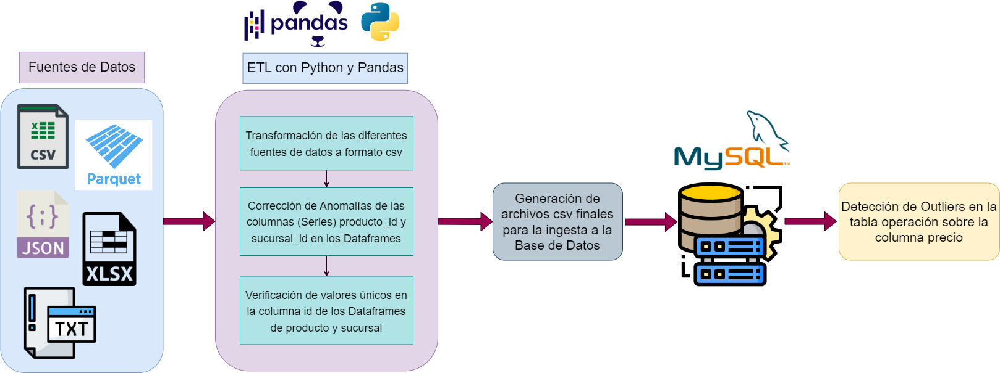
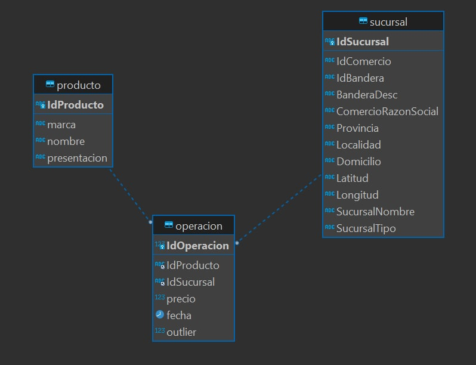

# ETL-Python-Pandas-Mysql (Proyecto 01 para HENRY)

En este proyecto se desarrolla la extracción, transformación y carga de archivos que se encuentran en diferentes formatos utilizando Python, Pandas y MySQL. 
Python y Pandas colaboraron para que todos los archivos tengan un formato en común, en este caso csv y, además, transformaron algunos datos para una mejor ingesta en la base de datos. Hasta aquí esto se realizó de manera automática simplificando la tarea en dos archivos .py: ***procesar.py*** encargado de convertir todos los archivos de diferentes formatos a csv y ***up.py*** para subir los csv procesados a la base de datos especificando host, usuario, password y nombre de la base de datos. Los archivos a procesar deben estar subidos en una carpeta llamada DataSets.
Por último, desde MySQL Workbench, se buscaron algunos outliers para clasificarlos.

### Pasos que se siguieron
- Análisis del estado de los datos en los diferentes archivos.
- Creación de la base de datos y sus respectivas tablas: sucursal, producto y operación.
- ETL con Python y Pandas.
- Transformación de los archivos a formato csv definitivos y carga en la base de datos utilizando MySQL.
- Detección de Outliers en la tabla Operación.

### 1. *Análisis del estado de los datos*  
En esta etapa se analizó el estado de los datos en los diferentes archivos de manera manual y con ayuda de Python y Pandas. Aquí se encontraron datos duplicados, datos faltantes y carga de datos con un patrón no estandarizado. 

### 2. *Creación de la Base de Datos y sus Tablas*  
Se creo la base de datos con sus respectivas tablas: sucursal para los datos que llegan de sucursal, producto para los datos que llegan de producto y operacion para los datos que llegan con los precios semanales. 
En este repositorio se brinda un archivo sql con el script necesario para crear la base de datos para facilitar la creación de su estructura y el backup de los datos guardados. 

### 3. *ETL con Python y Pandas*  
Primero, se preparó los diferentes archivos para la normalización de los datos. Todos fueron transformados a csv con una columna más para identificar la fecha (fue extraído del nombre del archivo).
Luego, se comenzó el proceso de ETL sobre estos archivos csv creados. Aquí se quitaron duplicados de producto y sucursal, pero, no de los archivos que tenían los precios de la semana ya que es una tabla de hechos. Además, en los Dataframes de producto y sucursal se quitaron las filas que tenían nulos en su columna id y específicamente en el de producto se eliminaron 3 columnas que poseían únicamente 4 valores no nulos; estas son: categoría 1, categoría 2 y categoría 3.
Con respecto a las columnas de producto_id y sucursal_id de todos los Dataframes en ellas se aplicaron diferentes procedimientos. En el caso de producto_id para que tenga 13 caracteres se completó con ceros los espacios faltantes debido a que representaba a un código de barras, había valores que tenían un punto por lo que se lo quitó seguido de todo lo que se encontraba después, y se dejaron intactos los valores que estaban completos, pero además tenían un identificador de la cadena de la sucursal ya que gracias a esto eran únicos. Esta decisión fue tomada porque cada sucursal tiene diferentes precios para un mismo producto.
Por otro lado, se buscó normalizar el formato de sucursal_id porque los datos estaban cargados de diferentes modos.

### 4)	*Archivos csv definitivos y carga en la Base de Datos*  
En la última etapa del proceso de ETL, se generaron los archivos csv definitivos para la ingesta en la base de datos. Para esto se utilizó MySQL a través de la librería PyMysql. 
Los anteriores pasos han sido automatizados. Para realizarlos simplemente debemos ejecutar el archivo carga de datos.

### 5)	*Detección de Outliers en la Tabla operacion* 
Por último, utilizando MySQL Workbench se buscaron los outliers de la tabla operación en su campo precio con el fin de identificarlos y que las personas que consulten esa tabla conozcan que existen y decidan que hacer con ellos. 

**Video Explicativo**
Análisis del estado de los datos en los diferentes archivos (pendiente).

**Contacto**
mimundo.lalayupii@gmail.com
